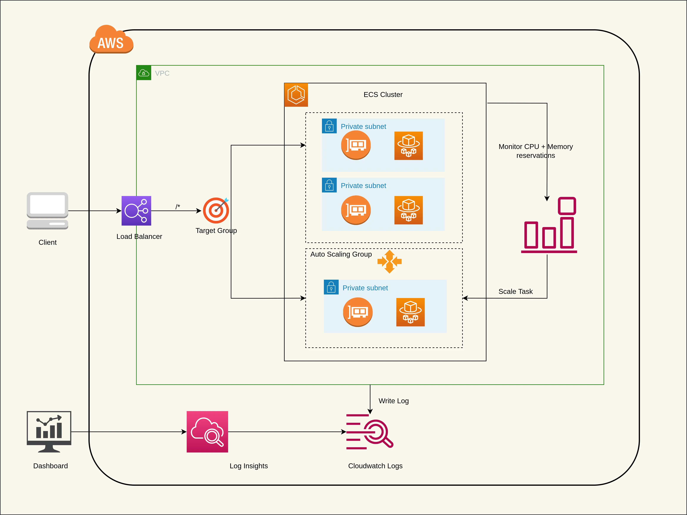
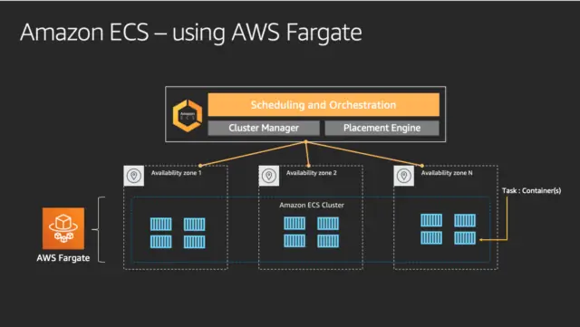
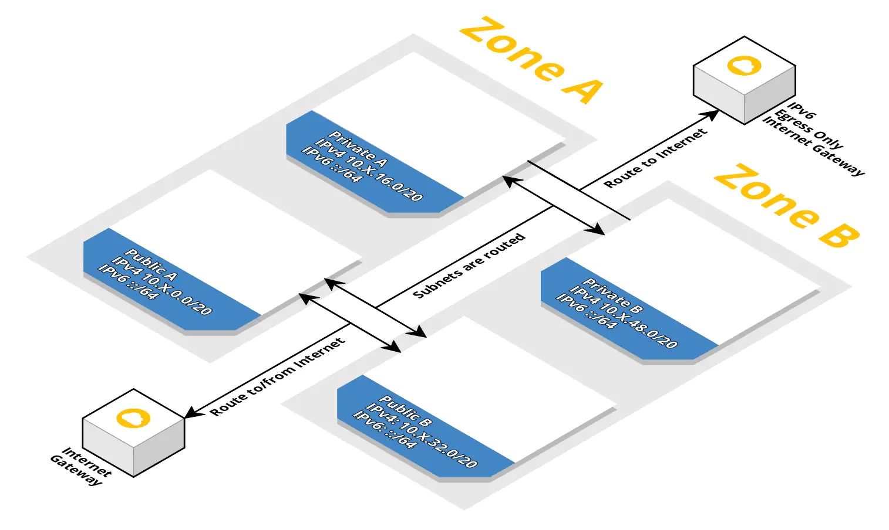
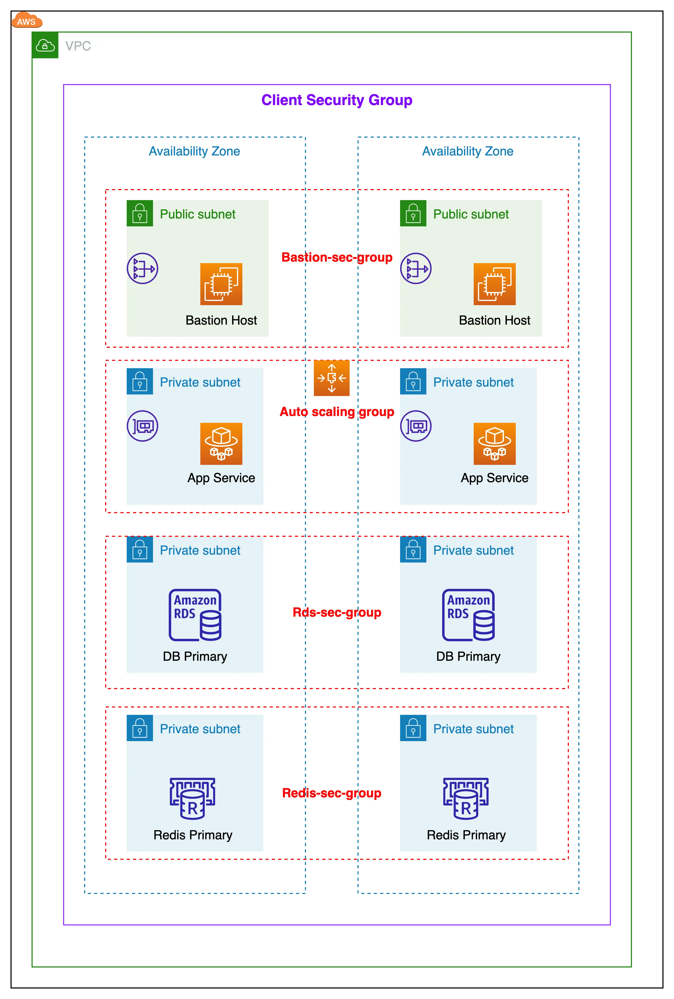
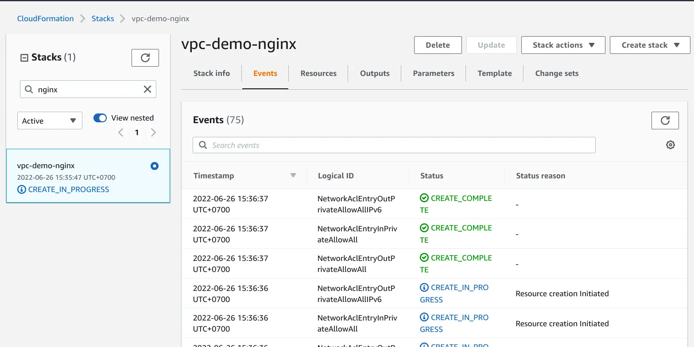
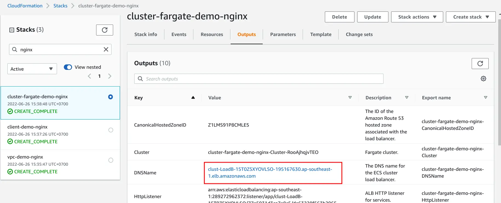
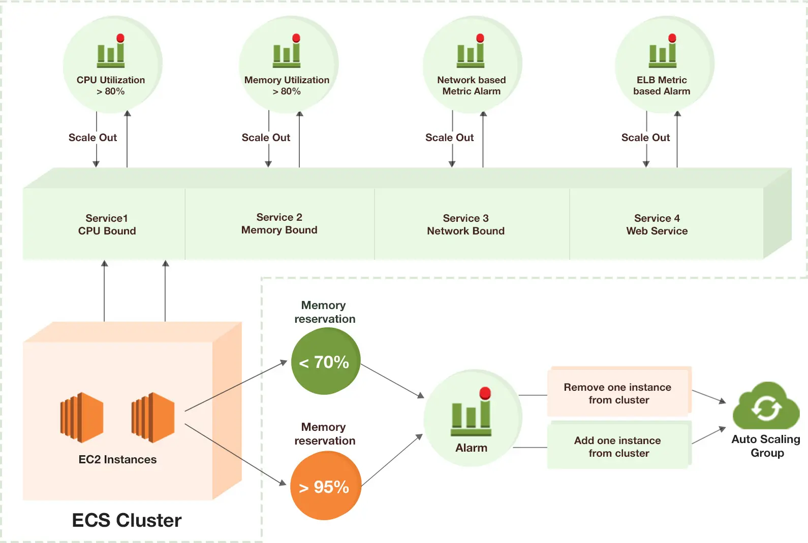
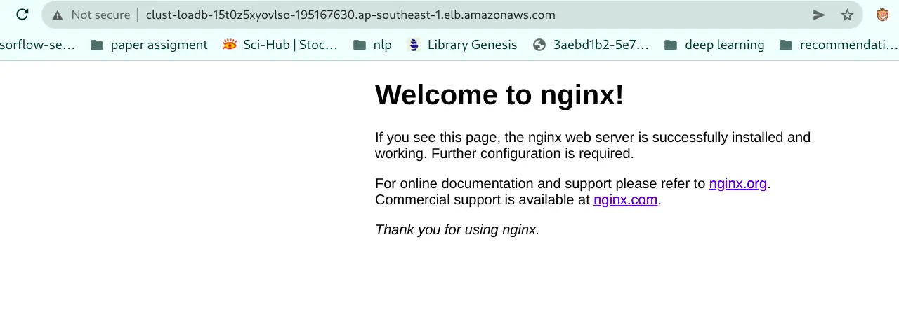
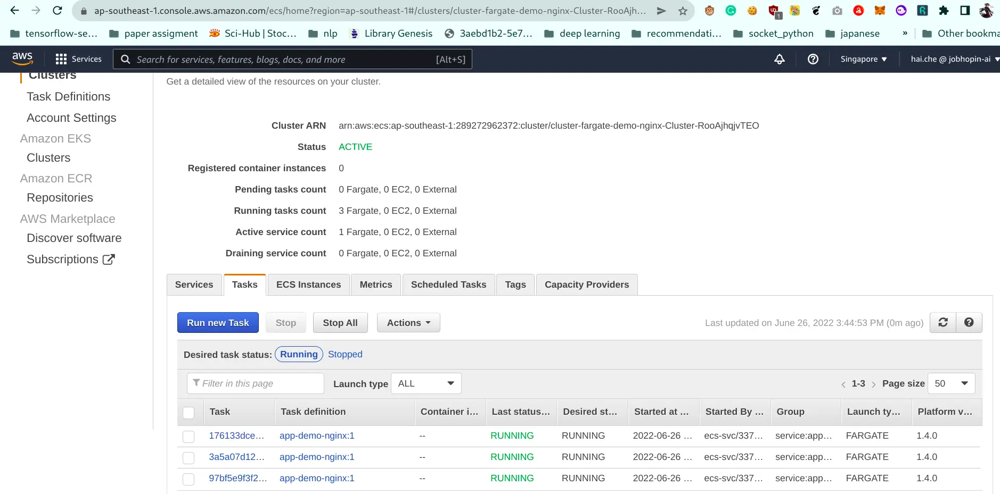

Deploying individual containers is not difficult. However, when you need to coordinate many container deployments, a container management tool like ECS can greatly simplify the task (no pun intended).

For serverless approach, the best combination recipe for ECS cluster is AWS OnDemand and spot Fargate. The blog will describe how we can deploy ECS cluster by infrastructure as code (IAC) with optimal cost.

<!--more-->



**Disclaimer**, The blog is strongly inspired by the beautiful template in [widdix cloudformation](https://github.com/widdix/aws-cf-templates). If you find this blog is useful, consider give a start the origin GitHub.



## Introduction

ECS consists of a few components:

* ECS Cluster: The Cluster definition itself where you will specify how many instances you would like to have and how it should scale.
* Task Definition: ECS refers to a JSON formatted template called a Task Definition that describes one or more containers making up your application or service. The task definition is the recipe that ECS uses to run your containers as a task on your EC2 instances or AWS Fargate.
* Service: Based on a Task Definition, is used to guarantee that you always have some number of Tasks running at all times. A Service is responsible for creating Tasks.

From this blog, you will be using Docker Nginx to create a fully working solution ECS cluster with autoscaling and capacity provider strategy that mixes OnDemand and Spot for optimal cost.



**TL;DR:** The sources being used in this blog are available at [GitHub](https://github.com/haicheviet/blog-code/tree/main/ecs-cost-optimization-with-fargate).

## Fargate OnDemand vs Spot



AWS Fargate is a technology that you can use with Amazon ECS to run containers without having to manage servers or clusters of Amazon EC2 instances. With Fargate, you no longer have to provision, configure, or scale clusters of virtual machines to run containers. This removes the need to choose server types, decide when to scale your clusters or optimize cluster packing. [Ref](https://docs.aws.amazon.com/AmazonECS/latest/userguide/what-is-fargate.html).





Moreover Fargate Spot allows you to deploy your containers as you would normally in Fargate, but benefit from savings since your containers will be running on spare AWS capacity. Below is the comparation between Fargate OnDemand vs spot in *eu-west-1 region* [Ref](https://tomgregory.com/aws-fargate-spot-vs-fargate-price-comparison/).



|     |Fargate|Fargate Spot|Fargate Spot saving|
|:---:|:-----:|:----------:|:-----------------:|
|CPU  |$0.04048|$0.01334053|67%|
|Memory|$0.004445|$0.00146489|67%|

> Cost example: a 0.25 vCPU and 0.5 GB Fargate container running for 24 hours would cost **$0.29622** (calculated as 0.04048 \* 0.25 \* 24 + 0.004445 \* 0.5 \* 24).

> Cost example: a 0.25 vCPU and 0.5 GB Fargate Spot container running for 24 hours would cost **$0.09762186** (calculated as 0.01334053 \* 0.25 \* 24 + 0.00146489 \* 0.5 \* 24).



## Cloudforamtion IAC structure

Our Cloudformation code was structure by these following components:

### Description and Metadata

The template Description enables you to provide arbitrary comments about your template. It is a literal variable string that is between 0 and 1024 bytes in length; its value cannot be based on a parameter or function.

You can use the optional Metadata section to include arbitrary JSON or YAML objects that provide details about the template.

```yaml
AWSTemplateFormatVersion: '2010-09-09'
Description: 'VPC: public and private subnets in two availability zones'
Metadata:
  'AWS::CloudFormation::Interface':
    ParameterGroups:
    - Label:
        default: 'VPC Parameters'
      Parameters:
      - ClassB
```

### Parameters

Use the **optional Parameters** section to customize your templates. Parameters enable you to input custom values to your template each time you create or update a stack. For example, you can pass parameters in the AWS CLI or you can type the values in the AWS console while creating an instance.

```yaml
Parameters:
  ClassB:
    Description: 'Class B of VPC (10.XXX.0.0/16)'
    Type: Number
    Default: 0
    ConstraintDescription: 'Must be in the range [0-255]'
    MinValue: 0
    MaxValue: 255
```

### Resouce

In the **Resources section**, you declare the AWS resources you want as part of your stack. Each resource must have a logical name unique within the template. This is the name you use elsewhere in the template as a dereference argument. Because constraints on the names of resources vary by service, all resource logical names must be alphanumeric **[a-zA-Z0-9]** only. You must specify the type for each resource. Type names are fixed according to those listed in [Resource Property Types](https://docs.aws.amazon.com/AWSCloudFormation/latest/UserGuide/aws-template-resource-type-ref.html) reference on the AWS website. If a resource does not require any properties to be declared, you can omit the Properties section of that resource.

```yaml
Resources:
  VPC:
    Type: 'AWS::EC2::VPC'
    Properties:
      CidrBlock: !Sub '10.${ClassB}.0.0/16'
      EnableDnsSupport: true
      EnableDnsHostnames: true
      InstanceTenancy: default
      Tags:
      - Key: Name
        Value: !Sub '10.${ClassB}.0.0/16'
```

### Outputs

The optional **Outputs section** declares output values that you can import into other stacks (to create cross-stack references), return in response (to describe stack calls) or view on the AWS CloudFormation console. For example, you can output the S3 bucket name for a stack to make the bucket easier to find.

```yaml
Outputs:
  VPC:
    Description: 'VPC.'
    Value: !Ref VPC
    Export:
      Name: !Sub '${AWS::StackName}-VPC'
```

## Image registry

ECS supports both public image and private image [ECR](https://aws.amazon.com/ecr/). For simplicity, we will use the public registry [nginx](https://hub.docker.com/_/nginx) for our main image.
To create a private image ECR is somehow simple, you can following [this guide](https://www.youtube.com/watch?v=Brm21SWac-I) to create private repositories.

## VPC and Client-sg network

### VPC network

A VPC is a virtual network inside AWS where you can isolate your workload. A VPC consists of several subnets. Each subnet is bound to an Availability Zone. A **public** subnet has a direct route to/from the Internet. As long as your service have an public IPv4/IPv6 address, they **can communicate (in and out) with the Internet**. A private subnet does not have a IPv4 route to/from the Internet but an Ipv6 route to the Internet exists. Service in **private** subnets can not be accessed from the public Internet. If you want to access the Internet from a private subnet, you need to create a NAT gateway/instance or assign an IPv6 address. You can deploy a bastion host/instance to reduce the attack surface of internal applications.



### Client Security Group network

Some data stores are integrated into the VPC, others are only accessible via the AWS API. For VPC integration, you have to create a Client Security Group stack. The stack is used as a parent stack for security groups ElastiCache, Elasticsearch, and RDS. To expand communication with the data store from an EC2 instance, you have to attach the Client Security Group to the EC2 instance. The Security Group does not have any rules, but it marks traffic. The marked traffic is then allowed to enter the data store.



With this appoarch, we can well [separate of concerns](https://en.wikipedia.org/wiki/Separation_of_concerns) and security our app. Only service that subscribers to our client sg can communicate in cluster stack.

The full template file is in GitHub repo [vpc-2azs.yml](https://github.com/haicheviet/blog-code/blob/main/ecs-cost%20optimization-with-fargate/aws/vpc-2azs.yml) and [client-sg.yml](https://github.com/haicheviet/blog-code/blob/main/ecs-cost%20optimization-with-fargate/aws/client-sg.yml), below is bash CLI to run these stack.

`bash aws-init-vpc.sh`

```bash
PROJECT_NAME=${PROJECT_NAME?Variable not set}
APP_ENV=${APP_ENV?Variable not set}

echo ">>>>>>>>>>>VPC for $PROJECT_NAME - $APP_ENV<<<<<<<<<<<<"
sleep 1

aws cloudformation deploy \
    --template-file aws/vpc-2azs.yml \
    --stack-name vpc-$APP_ENV-$PROJECT_NAME \
    --capabilities CAPABILITY_NAMED_IAM \
    --tags $PROJECT_NAME-$APP_ENV-cluster=vpc

echo ">>>>>>>>>>>Client for $PROJECT_NAME - $APP_ENV<<<<<<<<<<<<"
sleep 1

aws cloudformation deploy \
    --template-file aws/client-sg.yml \
    --stack-name client-$APP_ENV-$PROJECT_NAME \
    --capabilities CAPABILITY_NAMED_IAM \
    --parameter-overrides ParentVPCStack=vpc-$APP_ENV-$PROJECT_NAME \
    --tags $PROJECT_NAME-$APP_ENV-cluster=client
```

The Cloudformation stack can be displayed in CloudFormation and navigate to the **Stack section**. In the **Events tab** of the stack, the progress of creating the stack can be followed.



### Outputs



* VPC with public and private subnets in two availability zones.
* Internet Gateway.
* Route tables and Network ACLs.
* Client security group.



## ECS cluster and Load Balancer

### ECS cluster

This file starts from the [cluster-fargate.yml](https://github.com/haicheviet/blog-code/blob/main/ecs-cost%20optimization-with-fargate/aws/cluster-fargate.yml) file where you will add the cluster and ALB configuration.

```yaml
Resources:
  Cluster:
    Type: 'AWS::ECS::Cluster'
    Properties:
      CapacityProviders: 
      - FARGATE
      - FARGATE_SPOT # Enable fargate spot provider
      ClusterName: !Sub ${AWS::StackName}
...
```

### Application load balancer (ALB)

The ALB configuration requires the configuration of the subnets to use. We will define ALB with enable both HTTP/HTTPS and S3 logging.


```yaml
Parameters:
  LoadBalancerCertificateArn:
    Description: 'Optional Amazon Resource Name (ARN) of the certificate to associate with the load balancer. If set, HTTP requests are redirected to HTTPS.'
    Type: String
    Default: ''
  LoadBalancerIdleTimeout:
    Description: 'The idle timeout value, in seconds.'
    Type: Number
    Default: 60
    MinValue: 1
    MaxValue: 4000
  ...
Resources:
  LoadBalancer:
    Type: 'AWS::ElasticLoadBalancingV2::LoadBalancer'
    Properties:
      IpAddressType: !If [HasLoadBalancerSchemeInternal, 'ipv4', 'dualstack']
      LoadBalancerAttributes:
      - Key: 'idle_timeout.timeout_seconds'
        Value: !Ref LoadBalancerIdleTimeout
      - Key: 'routing.http2.enabled'
        Value: 'true'
      - Key: 'access_logs.s3.enabled'
        Value: !If [HasS3Bucket, 'true', 'false'] # Enable write log ALB to s3
      ...
  LoadBalancerSecurityGroupInHttpFromWorld:
    Type: 'AWS::EC2::SecurityGroupIngress'
    Condition: HasNotAuthProxySecurityGroup
    Properties:
      GroupId: !Ref LoadBalancerSecurityGroup
      IpProtocol: tcp
      FromPort: 80 # Enable http traffic
      ToPort: 80
      CidrIp: '0.0.0.0/0'
  LoadBalancerSecurityGroupInHttpsFromWorld:
    Type: 'AWS::EC2::SecurityGroupIngress'
    Condition: HasNotAuthProxySecurityGroupAndLoadBalancerCertificateArn
    Properties:
      GroupId: !Ref LoadBalancerSecurityGroup
      IpProtocol: tcp
      FromPort: 443 # Enable https traffic
      ToPort: 443
      CidrIp: '0.0.0.0/0'
  HTTPCodeELB5XXTooHighAlarm:
    Condition: HasAlertTopic
    Type: 'AWS::CloudWatch::Alarm'
    Properties:
      AlarmDescription: 'Application load balancer returns 5XX HTTP status codes'
      Namespace: 'AWS/ApplicationELB'
      MetricName: HTTPCode_ELB_5XX_Count
      ...
  RejectedConnectionCountTooHighAlarm:
    Condition: HasAlertTopic
    Type: 'AWS::CloudWatch::Alarm'
    Properties:
      AlarmDescription: 'Application load balancer rejected connections because the load balancer had reached its maximum number of connections'
      Namespace: 'AWS/ApplicationELB'
      MetricName: RejectedConnectionCount
      ...
...
```

To start ecs cluster stack, run the below command.

`bash aws-init-cluster.sh`

```bash
PROJECT_NAME=${PROJECT_NAME?Variable not set}
APP_ENV=${APP_ENV?Variable not set}

echo ">>>>>>>>>>>Cluster for $PROJECT_NAME - $APP_ENV<<<<<<<<<<<<"
sleep 1

aws cloudformation deploy \
    --template-file aws/cluster-fargate.yml \
    --stack-name cluster-fargate-$APP_ENV-$PROJECT_NAME \
    --capabilities CAPABILITY_NAMED_IAM \
    --parameter-overrides ParentVPCStack=vpc-$APP_ENV-$PROJECT_NAME \
    --tags $PROJECT_NAME-$APP_ENV-cluster=ecs-cluster
```

### Outputs



* ECS cluster with enabling both Fargate OnDemand and Spot provider.
* Dedicate load balancer for this specific cluster.
* HTTP/HTTPS ALB.
* Logging to s3 (*Optional*).
* CloudWatch alarm 5xx and maximum number of connections (*Optional*).





The red rectangle is domain DNS for our application that will be used in task definition.

## Task Definitions and Autoscaling

### Task Definitions

Configure task and ECS service in Cloudformation with mix provider strategy.

```yaml
Parameters:
  DesiredCount:
    Description: "The number of simultaneous tasks, that you want to run on the cluster."
    Type: Number
    Default: 2
    ConstraintDescription: "Must be >= 1"
    MinValue: 1
  MaxCapacity:
    Description: "The maximum number of simultaneous tasks, that you want to run on the cluster."
    Type: Number
    Default: 4
    ConstraintDescription: "Must be >= 1"
    MinValue: 1
  MinCapacity:
    Description: "The minimum number of simultaneous tasks, that you want to run on the cluster."
    Type: Number
    Default: 2
    ConstraintDescription: "Must be >= 1"
    MinValue: 1
  AutoScaling:
    Description: "Scale number of tasks based on CPU load?"
    Type: String
    Default: "true"
    AllowedValues: ["true", "false"]
...
Resources:
  TaskDefinition:
    Type: 'AWS::ECS::TaskDefinition'
    Properties:
      ContainerDefinitions:
      - Name: app
        Image: !Ref AppImage
        PortMappings:
        - ContainerPort: !Ref AppPort
          Protocol: tcp
        ...
      # Define resource
      Cpu: !FindInMap [CpuMap, !Ref Cpu, Cpu]
      Memory: !FindInMap [MemoryMap, !Ref Memory, Memory]
      NetworkMode: awsvpc # simplifies container networking
      RequiresCompatibilities: [FARGATE]
      ...
  Service:
    DependsOn: LoadBalancerListenerRule
    Type: 'AWS::ECS::Service'
    Properties:
      Cluster: {'Fn::ImportValue': !Sub '${ParentClusterStack}-Cluster'}
      CapacityProviderStrategy:
      - Base: 0
        CapacityProvider: FARGATE
        Weight: 2 # 2 tasks run on FARGATE
      - Base: 0
        CapacityProvider: FARGATE_SPOT
        Weight: 1 # 1 tasks run on FARGATE_SPOT
      DeploymentConfiguration:
        MaximumPercent: 200
        MinimumHealthyPercent: 100
        DeploymentCircuitBreaker:
          Enable: true
          Rollback: true
      TaskDefinition: !Ref TaskDefinition
      HealthCheckGracePeriodSeconds: !Ref HealthCheckGracePeriod
...
```

### Autoscaling

You can increase or decrease your desired task count by integrating Amazon ECS on Fargate with Amazon CloudWatch alarms and Application Auto Scaling. Then, you can use CloudWatch metrics to configure your CloudWatch alarms and only scale if CPU utilization higher/lower than certain threshold.



```yaml
Resources:
  ScalableTarget:
    Condition: HasAutoScaling
    Type: 'AWS::ApplicationAutoScaling::ScalableTarget'
    Properties:
      MaxCapacity: !Ref MaxCapacity
      MinCapacity: !Ref MinCapacity
      ResourceId: !Sub
      ScalableDimension: 'ecs:service:DesiredCount'
      ServiceNamespace: ecs
...
```

To start ecs service, run the below command with [app-demo.yml](https://github.com/haicheviet/blog-code/blob/main/ecs-cost%20optimization-with-fargate/aws/task-definition/app-production.yml).

`bash aws-init-task.sh`

```bash
PROJECT_NAME=${PROJECT_NAME?Variable not set}
APP_ENV=${APP_ENV?Variable not set}
APP_IMAGE=${APP_IMAGE?Variable not set}

echo ">>>>>>>>>>> App for $PROJECT_NAME $APP_ENV<<<<<<<<<<<<"
aws cloudformation deploy \
    --template-file aws/task_definition/app-$APP_ENV.yml \
    --stack-name app-$APP_ENV-$PROJECT_NAME \
    --capabilities CAPABILITY_NAMED_IAM \
    --parameter-overrides ParentVPCStack=vpc-$APP_ENV-$PROJECT_NAME \
        AppEnvironment1Key=APP_ENV \
        ParentClusterStack=cluster-fargate-$APP_ENV-$PROJECT_NAME \
        ParentClientStack1=client-$APP_ENV-$PROJECT_NAME \
        AppEnvironment1Value=$APP_ENV \
        AppImage=$APP_IMAGE \
        AutoScaling=true \
        Cpu=0.25 \
        Memory=0.5 \
        DesiredCount=3 \
    --tags $PROJECT_NAME-$APP_ENV-cluster=service-$APP_IMAGE
```

### Outputs



* ECS task with nginx image.

* Fargate task with strategy `2(OnDemand): 1(Spot)`, task running should be `n+1` for [voting policy](https://www.continuent.com/resources/blog/why-does-mysql-mariadb-cluster-require-odd-number-nodes)

* Autoscaling group and healthcheck.



Navigate to the cluster-stack, retrieve the public DNS in **Output section** and verify whether the containers can be reached and a welcome message from Nginx.



We can run the following command to see how tasks spread across capacity providers.

```bash
aws ecs describe-tasks \
--tasks $(aws ecs list-tasks --cluster $CLUSTER_NAME --query taskArns[*] --output text) \
--cluster $CLUSTER_NAME \
--query 'sort_by(tasks,&capacityProviderName)[*].{TaskArn:taskArn,CapacityProvider:capacityProviderName,Instance:containerInstanceArn,AZ:availabilityZone,Status:lastStatus}' \
--output table

```

The output of the above command should display a table as below.

|       AZ        | CapacityProvider  | Instance  |    Status | TaskArn |
|:---------------:|:-----------------:|:---------:|:---------:|---------|
|  ap-southeast-1b|  FARGATE          |  None     |  RUNNING |  arn:aws:ecs:XXXXXXXX:task/cluster-fargate-demo-nginx-Cluster/task-1   |
|  ap-southeast-1a|  FARGATE          |  None     |  RUNNING      |  arn:aws:ecs:XXXXXXXX:task/cluster-fargate-demo-nginx-Cluster/task-2   |
|  ap-southeast-1b|  FARGATE_SPOT     |  None     |  RUNNING      |  arn:aws:ecs:XXXXXXXX:task/cluster-fargate-demo-nginx-Cluster/task-3   |

## Cleanup

Cleaning up the resources is fairly easy now. Navigate to the **Stack** and click the **Delete button**. The progress of deletion can be tracked in the **Events tab**. This will take some minutes, but the good news is, that no manual deletion of resources must be done. Everything which has been created with the template is automatically removed.

## TL;DR

The ecs cluster can be shortly describe with these step:

`Step 1`: Export all the needed enviroment.

```bash
git clone https://github.com/haicheviet/blog-code.git
cd blog-code/ecs-cost-optimization-with-fargate

# Export all the needed enviroment
export APP_ENV=demo
export PROJECT_NAME=nginx
export APP_IMAGE=nginx:latest

# VPC and Client-sg stack
bash aws-init-vpc.sh

# ECS cluster stack
bash aws-init-cluster.sh

# ECS service stack
bash aws-init-task.sh
```

Verify ECS stack working.



Congratulations! you have reached the end of the blog. We covered a lot of ground learning how to apply ECS Fargate Spot best practices such as diversification, as well as the use of capacity providers.



In the blog, we have covered:

* Deployed a CloudFormation Stack that prepared our environment, including our VPC and a Client-SG environment.
* Created and configured an ECS cluster with ALB.
* Created Auto Scaling Groups and Capacity Providers associated with them for OnDemand and Spot.
* Configured a Capacity provider strategy that mixes OnDemand and Spot.
* Learned how ECS Cluster Scaling works with Capacity Providers.




## Some afterthought

* Fargate Spot is configured automatically to capture Spot Interruptions and set the task in **DRAINING** mode, a **SITERM** is sent to the task and containers and the application. That's why the service application have to be handle graceful timeout, if you should use gunicorn like me, here is the [link](https://docs.gunicorn.org/en/stable/settings.html?highlight=graceful#graceful-timeout) to configure deployment option.
* Choosing Fargate task sizes sometimes is tricky, you have to monitor your application's usual usage and should set memory tasks always below 75% utilization to get the best performance [Ref](https://nathanpeck.com/amazon-ecs-scaling-best-practices/).
* The combined technique ECS-Fargate is so great and cost-effective that making k8s is too complicated for small-medium team size.
