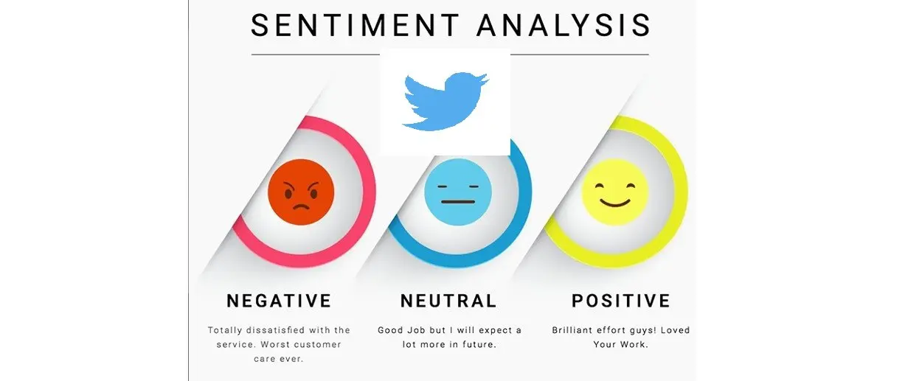
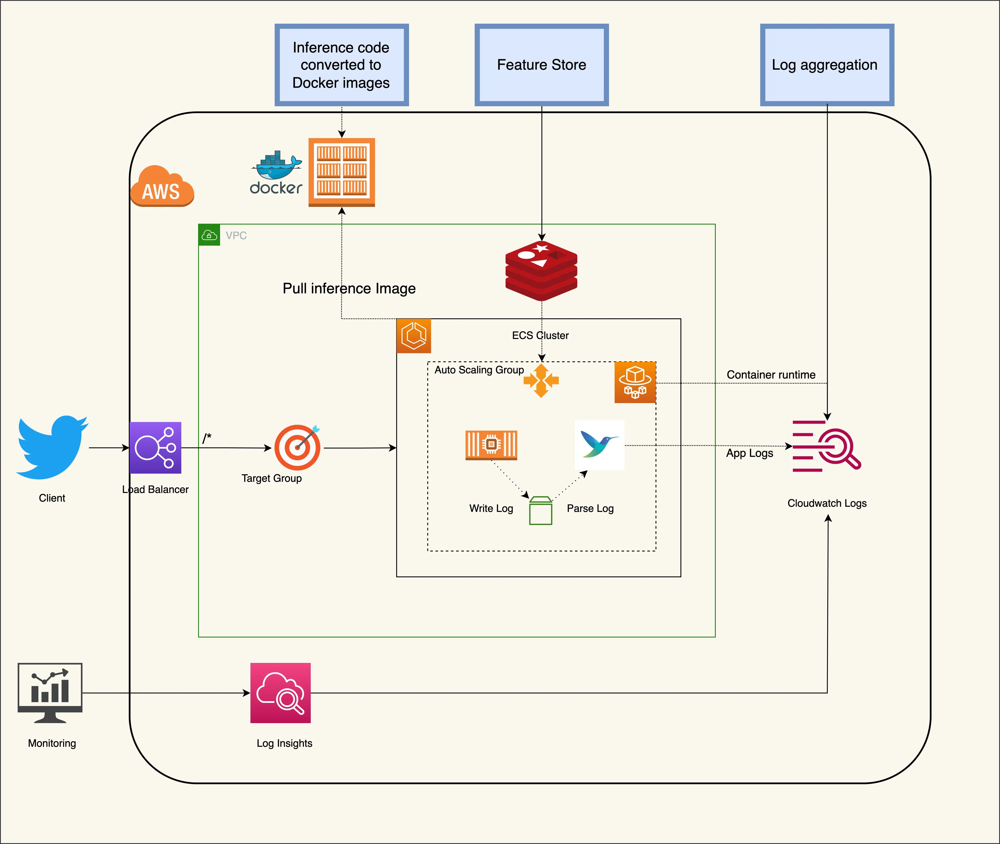
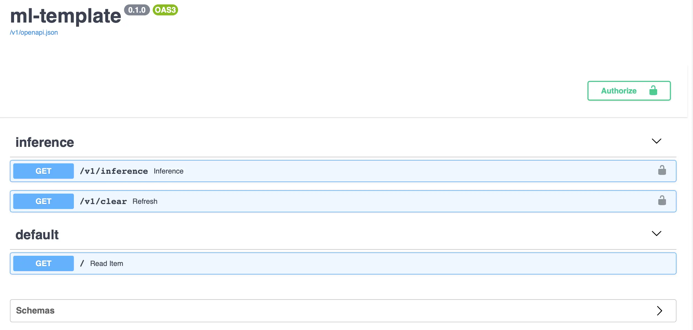
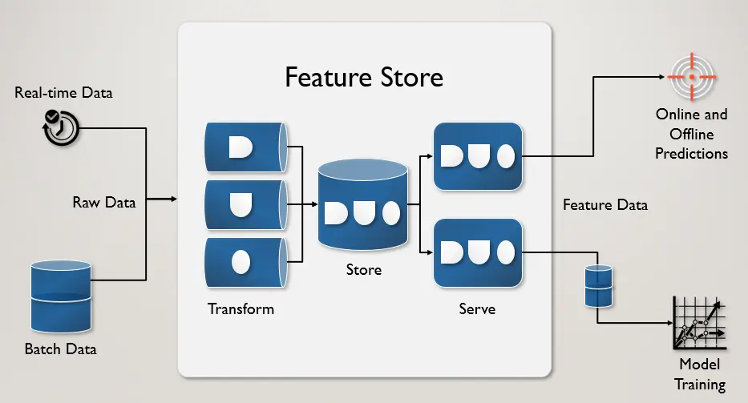
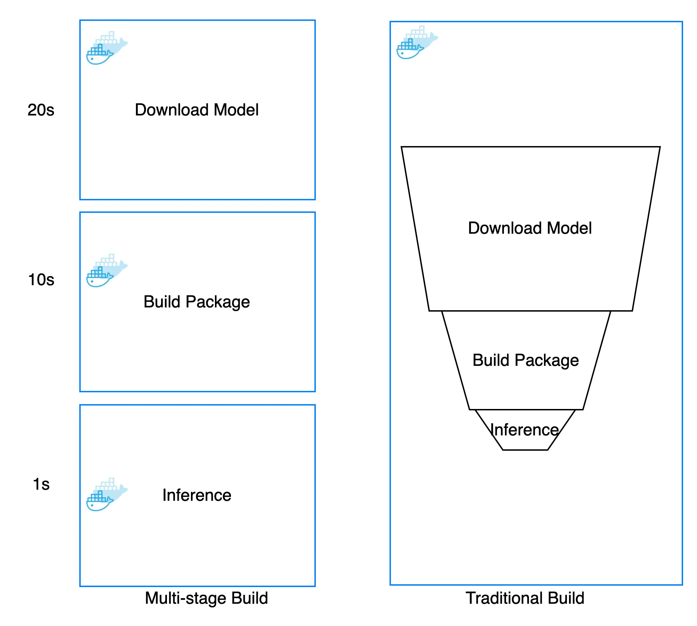
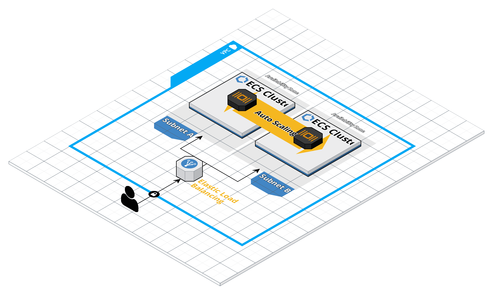
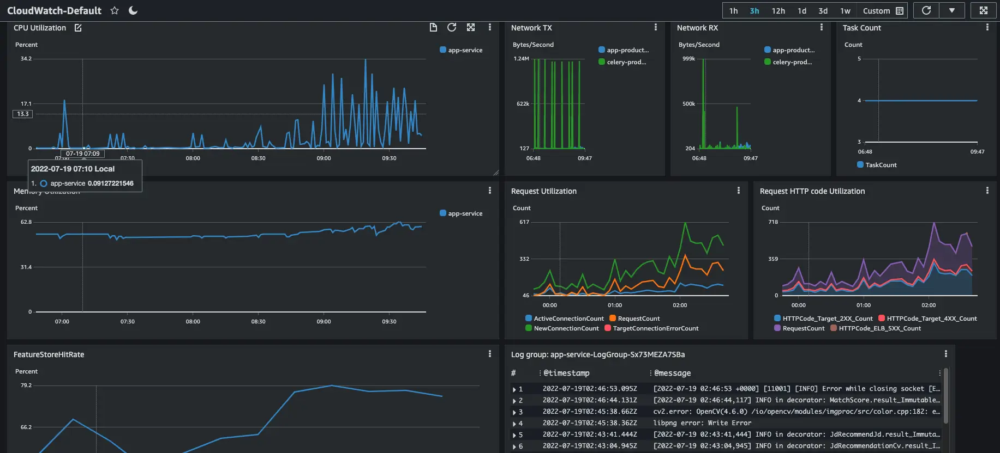
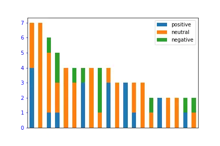
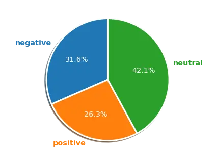

Machine learning inference has evolved tremendously in the past several years. With a wide variety of tools and frameworks out there to simplify deployment and logging. But often, the inference step is usually bypassed and not shiny as building ML model. However in the ML cycle, the training ML model only took 20 percent of the full pipeline ML project. Especially serving AI model in end-user is rather simple and only for MVC phase. Therefore how we can server AI model in the real world and make the AI inference cycle fast both in the implementation stage, logging, and rebuilding. We will dive deep into some best practices in software development and how they can be implemented in AI respective.

<!--more-->
## Introduction

For the hands-on AI project, we will use Twitter sentiment analyst to demonstrate our project.


The idea of the project is to get metadata from Twitter URL and sentiment analyst content. After that, we will aggregate sentiment text from the individual user to analyze more sentiment for each user.



The service can be described in the diagram below and full project available in our [github repo](https://github.com/haicheviet/blog-code/tree/main/machine-learning-inference-on-industry-standard)





## Choosing the right format model

The model I pick is [transformer roberta model](https://huggingface.co/cardiffnlp/twitter-roberta-base-sentiment) to analyst text sentiment
Firstly, we will find optimize model format to boost inference and standardized our inference code. For pytorch model, we used [torch script](https://pytorch.org/docs/stable/jit.html) to tranform our model to jit format. The translate code is in my [github](https://github.com/haicheviet/blog-code/blob/main/machine-learning-inference-on-industry-standard/visulization/generate_torch_script.py), you can reproduce and testing by yourself.


The performance boost is not much but for [GPU model](https://www.educba.com/pytorch-jit/) the runtime of torchscript proves to be better than PyTorch.

The serving code is somewhat simple `torch.jit.load` and already in [ScriptModule](https://pytorch.org/docs/stable/generated/torch.jit.ScriptModule.html#torch.jit.ScriptModule) format that will not change even we change our base model.

To further optimize model inference time, some techniques such as quantization or pruning can be applied but require deep dive into investigating model architecture and each architecture has its pruning method. [TVM](https://tvm.apache.org/) framework can be used for auto pruning but required more time and GPU resource to choose the right compile and inference architecture. The optimized process is very complicated and deserves its dedicated blog and I will talk about it at another time. For the PyTorch model, the no-brainer way is to convert to script format and gain 5->10% percent performance for free

## RestAPI and project template

For serving AI model, the most common protocol is Rest API and we will use [FastAPI](https://fastapi.tiangolo.com/) for our serving framwork. FastAPI was the third most loved web framework in [Stack Overflow 2021 Developer Survey](https://insights.stackoverflow.com/survey/2021/#section-most-loved-dreaded-and-wanted-web-frameworks) and support [OpenAPI](https://github.com/OAI/OpenAPI-Specification) out of the box. Furthermore, the combination of Pydantic and Fastapi is very smooth for readability and fast that I encourage most python developer should use.



- Auto-generated docs and simple front end for your API allow you to examine and interact with your endpoints with essentially no added work or tools

- Feature rich and performant

- Tight pairing with Pydantic makes specifying and validating data models easy





### Project code style

Coding in project have to be followed by standard style and lint check if member violate coding style. You can find auto format script in [format.sh](https://github.com/haicheviet/blog-code/blob/main/machine-learning-inference-on-industry-standard/scripts/format.sh) and [lint.sh](https://github.com/haicheviet/blog-code/blob/main/machine-learning-inference-on-industry-standard/scripts/lint.sh) check in github. For more python code style, we use [google python code style](https://google.github.io/styleguide/pyguide.html) for this project and here are some brief configurations guide

```toml
[tool.mypy]
ignore_missing_imports = true

[tool.isort]
profile = "black"

[tool.black]
line-length = 88

[flake8]
max-line-length = 88
exclude = .git,__pycache__,__init__.py,.mypy_cache,.pytest_cache,.eggs,.idea,.pytest_cache,*.pyi,**/.vscode/*,**/site-packages/
ignore = E722,W503,E203
```

### Environment managment

Using a environment file will enable us to easy switch local development without polluting the global environment namespace. It will also keep your environment variable names and values isolated to the same project that utilizes them.

```env
APP_ENV=demo
TWITTER_CONSUMER_KEY=...
TWITTER_CONSUMER_SECRET=...
TWITTER_ACCESS_TOKEN_KEY=...
TWITTER_ACCESS_TOKEN_SECRET=...
FIRST_SUPERUSER=...
FIRST_SUPERUSER_PASSWORD=...
REDIS_HOST=...
REDIS_PORT=...
```

One of the benefits of using a .env file is that it becomes much easier to develop with environment variables in mind early on. Thinking about these things at an earlier stage of the development process will make it easier for you to get your application ready for production.

### AI project tips

The deep learning model loading process is slow and we can not reload the model with every request which will cause a lot of overhead. We should load it once in the app context and pass the already loaded model into each request via [Request obj](https://fastapi.tiangolo.com/advanced/using-request-directly/)

```python
app = FastAPI(
    title=settings.PROJECT_NAME, openapi_url=f"{settings.API_V1_STR}/openapi.json"
)

model_params = {
    "model": get_model(),
    "tokenizer": get_tokenizer(),
}
app.model_params = model_params  # type: ignore
app.logger.info("Done loading model")  # type: ignore
...

@app.get("/inference", response_model=SentimentResponse)
@async_log_response
async def inference(
    request: Request,
    ...
):
  model = request.app.model_params["model"]
  tokenizer = request.app.model_params["tokenizer"]
...
```

## Feature Store

The natural of AI inference is lots of computing usage and timing, to maintain a healthy app and low latency serving API. We have to use a [feature store db](https://www.tecton.ai/blog/what-is-a-feature-store/) to store data and deliver a real-time experience for end-user.



The feature store provides a high throughput batch API for creating point-in-time correct training data and retrieving features for batch predictions, a low latency serving API for retrieving features for online predictions.



Redis database is most often selected as the foundation for the online feature store, thanks to its ability to deliver ultra-low latency with high throughput at scale.



Our project will use redis as backend to store data and serve if the prediction for specific text is already made. You can extend our class base Backend in the [project template](https://github.com/haicheviet/blog-code/blob/main/machine-learning-inference-on-industry-standard/app/feature_store/backends/__init__.py) and can be esasy replace with new data store.

We will discuss feature store in this following code snipet

```python
@router.get("/inference", response_model=SentimentResponse)
@async_log_response
async def inference(
    request: Request,
    tweetUrl: HttpUrl,
    background_tasks: BackgroundTasks,
    feature_store: Backend = Depends(get_backend),
    twitter_api: API = Depends(get_twitter_api),
):
    try:
        tweet = twitter_api.get_status(tweetUrl.split("/")[-1])
    except Exception as e:
        raise HTTPException(status_code=400, detail=f"Error{type(e).__name__}: {e}")
    key = Keys(tweet=tweet)
    data = await get_cache(keys=key, feature_store=feature_store)
    if not data:
        request.app.logger.info("Prediction is not exist in feature store")
        twitter_sentiment = TwitterSentiment(**request.app.model_params)

        prediction = twitter_sentiment.prediction(tweet.text)
        if prediction:
            result = SentimentResponse(
                sentiment_analyst=prediction, text_input=tweet.text
            )
            background_tasks.add_task(set_cache, result.dict(), key, feature_store)
        else:
            raise HTTPException(status_code=400, detail="Empty prediction")
    else:
        request.app.logger.info("Prediction hits")
        result = SentimentResponse(**data)

    return result
```

### Writing data to Feature Store

In FastAPI, you can run code outside of a web request after returning a response. This feature is called [background tasks](https://fastapi.tiangolo.com/tutorial/background-tasks/).

This is not as robust as using a background task library like Celery. Instead, Background Tasks are a simple way to run code outside of a web request, which is a great fit for things like updating a cache.

```python
background_tasks.add_task(set_cache, result.dict(), key, feature_store)
```

When you call `add_task()`, you pass in a function and a list of arguments. Here, we pass in `set_cache()` function. This function saves the prediction result to Redis. Let's look at how it works:

```python
async def set_cache(data, keys: Keys, feature_store: Backend):
    await feature_store.set(
        keys.cache_key(),
        json.dumps(data),
        expire=SIXTY_DAYS,
    )
```

First, we serialize the data to JSON and save it to feature_store. We use the expire parameter to set the expiration time for the data to sixty days.

### Reading Data from Feature Store

To use the endpoint inference, clients make a GET request to `/inference` with link tweet. Then we try to get the feature from Feature Store. If the prediction is not existed yet, we calculate the prediction, return it, and then save it outside of the web request.

```python
data = await get_cache(keys=key, feature_store=feature_store)
if not data:
  request.app.logger.info("Prediction is not exist in feature store")
  twitter_sentiment = TwitterSentiment(**request.app.model_params)

  prediction = twitter_sentiment.prediction(tweet.text)
  if prediction:
      result = SentimentResponse(
          sentiment_analyst=prediction, text_input=tweet.text
      )
      background_tasks.add_task(set_cache, result.dict(), key, feature_store)
else:
  request.app.logger.info("Prediction hits")
  result = SentimentResponse(**data)
```

## Dockerize application

After done coding section, we will use Docker to package our code and serve to end user. But the traditional Docker build is not dynamic caching and huge in image size that [cost a lot in develoment](https://renovacloud.com/how-to-reduce-your-docker-image-size-for-a-faster-build-deploy/?lang=en).
It was actually very common to have one Dockerfile to use for development (which contained everything needed to build your application), and a slimmed-down one to use for production, which only contained your application and exactly what was needed to run it. This has been referred to as the [builder pattern](https://refactoring.guru/design-patterns/builder). Maintaining two Dockerfiles is not ideal.
To maintain only on docker file, keep inference size low and enable caching for faster re-build, we will use [multi-stage builds](https://pythonspeed.com/articles/smaller-python-docker-images/) to dockerize AI service

An AI project's Docker usually is constructed in three steps and can be built to three different images:

- Download the AI model
- Install requires package
- Serving AI model



The traditional approach is built as a sequence of layers and each layer builds on top of the previous one. That is why when we increase the version of the AI model, we have to rebuild all docker layer and can not leverage independent layer even we only change AI model.

Multi-stage build enable us to seperate each step to seperate docker that can be reuse and independend with each other. Making each step can be esiy cached and we only need to rebuild what we changed. Here is some comparison of tradition vs multi-stage build:

|     |Multi-stage|Traditional|Saving|
|:---:|:-----:|:----------:|:----------:|
|Change AI model|11s|31s|64.5%|
|Last Image size|2.75GB|5.4GB|49%|

As you can see, the Multi-stage build save us a lot of time in building image and more lightweight serving. I can not overstate how frustrating and counter-productive in slow pipeline cause the amount of time wasted waiting for builds to complete adds up to 10 of thousands USD/year wasted even for small teams.


Docker multi-stage steps can be described in [build.sh](https://github.com/haicheviet/blog-code/blob/main/machine-learning-inference-on-industry-standard/scripts/build.sh) and [build-push](https://github.com/haicheviet/blog-code/blob/main/machine-learning-inference-on-industry-standard/scripts/build-push.sh) to docker hub. For a more in-dept tutorial in docker multi-stage, you should check out the [full guide here](https://pythonspeed.com/articles/smaller-python-docker-images/)

## Reliable service

When you are building a software application or a service, I’m sure you’ve heard of these big words: scalability, maintainability, and reliability. Espcially in AI project that usually to predict the unknow. Building an reliable service and SLA 99.99% uptime is substainly hard even for large team. To avoid pitfall in build everything on your own, Cloud vendor is more suitable otpion to deploy and scale our app. For small and medium team size, AWS ECS service and fargate is the best candidate to service our app at optimal cost and less maintenance, you can find more in [previous blog](https://haicheviet.com/ecs-cost-optimization-with-fargate/) that we're ready discussed about how well and suited of this architecture for small and medium team.



By leverage cloud vendor and serverless platform, we can minmize what can go wrong in AI app add avoid three common types of faults:

- Reliability: Fargate let us focus on building applications without managing servers. Every unknow hardward or software problem that make our app down will be notify and replace. ECS control plan will remove fail node and rebuild new node to our cluster.

- Scalability: AWS Auto Scaling monitors our applications and automatically adjusts capacity to maintain steady, predictable performance at the lowest possible cost and dynamic by traffic.

- Maintainability: AWS CloudFormation as IAC that helps us model and set up our AWS resources so that we can spend less time managing those resources and more time focusing on our applications that run in AWS.

The desciption steps to deploy AI application to ECS is in [here](https://github.com/haicheviet/blog-code/tree/main/machine-learning-inference-on-industry-standard/README.md)

## Monitoring and aggregate log

CloudWatch collects monitoring and operational data in the form of logs, metrics, and events, and visualizes it using automated dashboards so you can get a unified view of your AWS resources, applications, and services that run on AWS.

Keys monitoring metric in AI service:

- CPU and Ram usage
- Task autoscaling
- Feature Store hits
- Failure rate
- Logging



We can visualize how sentiment tweet of each user by using feature store. Notebook visualize is in [here](https://github.com/haicheviet/blog-code/blob/main/machine-learning-inference-on-industry-standard/visulization/tutorial.ipynb).

 

<!--   -->

## Some afterthought

- We haven't talked about the A/B testing model cause A/B test is very expensive both in platform cost and engineer resources. A hands-on project should not care too much about A/B test except if you already had a few hundred thousand active users to make A/B testing effective.

- Kubernetes cluster is more popular than ECS but needs more maintenance and a dedicated platform engineer to manage a cluster. We think the AI team should focus on model and metric rather than platform management, it is better to adopt Kubernetes in large-scale training rather than simple inference.

- Data drift and Concept drift are very important to monitor how well your AI model is. But the scope of this blog is already intensive. We will dive more into these concepts in a later blog.
