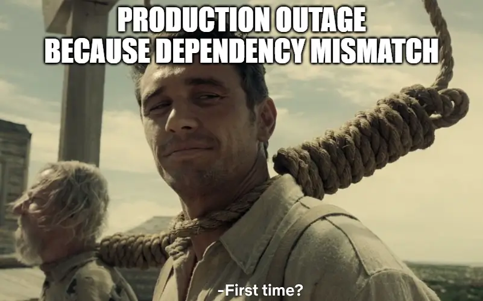
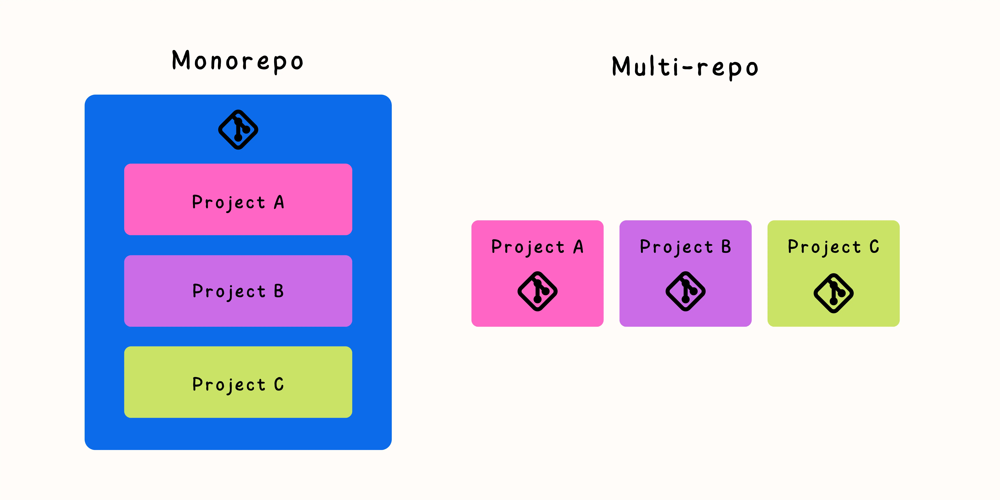

One of the biggest problems in my throughout year of working in tech industry is communication and ensure that everyone on team is onboard with each other. The thing here is not only communication in your team but as your whole ogrianziation as well. Mismatch dependency, API contract violate and intergation test is the most common bugs that I found in production and even countless post-mortern notes and meetings, no one can ensure that this problem will not occur again. But I think monorepo can be a solution for this nuisance, with the potential can lead to better communication and a more cohesive team.

<!--more-->
## Introduction

Have you ever made some minor change in your code, only to have to create four pull requests across multiple repositories and get them reviewed, spend half a day testing, and then wait a couple of hours for the changes to be released? Despite all the nonsense that you have been through, some jerks in another repository might decide that your code is no longer needed and delete it without your permission, causing an outage in production just for some minor change in API schemas!!!



Yup, been there and f\*ck that. This type of situation is not uncommon, and monorepos promise to fix it.

The philosophy of monorepo is really simple, keeping all of the code for a project in a single repository. Here is a general principles of monorepo



`Scopes`: The folders act as scopes to make sure code artifacts are only visible when they should be. This allows to extract common tasks (e.g. building a C# solution) quickly and maintainers can easier reason about where the error lies.

`The One Version Rule (Atomic Commits)`: The principle guarantee that you can commit atomically to both of related projects simultaneously. There is no view of the repository where Project A is at Commit #1 but Project B is at Commit #2.

`Big pictures`: With everything in one place there is no need to copy code between repositories or to look for infrastructure as code files and documentation.

`Good practice`: A monorepo requires teams to work with each other. By merging code only with a MR, teams review each other’s code which breaks silos and improves code quality.





> TLDR: Monorepos are not a new technology, but I find that the tooling around Python monorepos is still poor and more like a hack than making standard. My blog and [github repo](https://github.com/haicheviet/python-monorepo/blob/main/libs/ml/pyproject.toml) plan to solve that: 
> * A poetry environment playground with production release support.
> * Automated code formatting and linting for Python projects.
> * A Docker multi-stage CI/CD pipeline that supports sharing and caching of stages between libraries.
> * A test and coverage page for the entire monorepo, including all subprojects.

## Problem Statement

So what challenges does a monorepo address?:

* Improved collaboration: A monorepo facilitates better code collaboration among teams. With all the code visible in one place, it becomes straightforward to locate and comprehend the project's mechanics.
* Simplified Dependency Management: Monorepos simplify the intricacies of managing dependencies. Housing all code in one repository ensures easier monitoring of dependencies used throughout the project.
* Increased productivity: By consolidating all code into a singular repository, both build and test times can be diminished, leading to heightened productivity.
* Central CI/CD: Monorepos can be used to create a single CI/CD pipeline that automates the build, test, and deployment of all of the code in the project. This can help to improve the reliability and stability of the project, and it can free up developers to focus on more creative work.

However, all of the code in a single place can create new challenges for Ops teams to solve:

* How can we debug, standardlize flow and make cross change effiencely between multiple projects?
* Managing dependencies in a monorepo can be difficult, as it is important to ensure that all of the dependencies are compatible with each other. This can be especially difficult when the monorepo contains a large number of dependencies that depend each other.
* Each service has a different way of CI/CD and testing, so how can we merge all the pipelines into one flow?
* Monorepos promise that all test cases can be tested in one place, which sounds good but can be painful to implement. For example, if I just change some minor code in my project, every push to a merge request requires a full rerun of the test suites for all projects. This seems inconvenient and wasteful of resources.

The part one of [this series]() will discuss these items and hopefully solve some of the challanges above:

* Project structure
* Project standard (lint,test,packaging)
* Python enviroments management and debug

## Project structure

```markdown
├── .github/workflows           # Github action CI-CD
├── scripts/                    # General scripts
├── libs/                       # Share libs
│   └── ml/
│       ├── ml/                 # Source code
│       ├── tests/              # Unittest cases
│       ├── scripts/            # Build and test scripts
│       ├── pyproject.toml      # Requirement dependency and python metadata
│       └── poetry.lock         # Lock dependency
├── services/
│   └── fastapi-ml/
│       ├── app/                # Application code, mostly about client facing
│       ├── scripts/            # Build, test and deploy scripts
│       ├── tests/              # Unit and integration test cases
│       ├── pyproject.toml      # Requirement dependency and python metadata
│       └── poetry.lock         # Lock dependency
```

One of the most important decisions you'll make when setting up a monorepo is the structure of the top-level folders. These folders should be named in a clear and concise way, without any unnecessary complexity. This will make them easier to understand and navigate over time, even as the project grows and matures.

## Project standard

### Typechecking and Linting

I already talked about project code style before in [this blog](https://haicheviet.com/machine-learning-inference-on-industry-standard/#project-code-style). However, I recently came across a new tool called [ruff](https://github.com/astral-sh/ruff) that addresses issues with flake8. With this tool, the configuration is more concise, and all packages are consolidated into a single [pyproject.toml](https://github.com/haicheviet/python-monorepo/blob/main/services/fastapi-ml/pyproject.toml#L59) file.

```toml
[tool.mypy]
strict = true
ignore_missing_imports = true

[tool.black]
line-length = 88

[tool.ruff]
select = [
    "E",  # pycodestyle errors
    "W",  # pycodestyle warnings
    "F",  # pyflakes
    "I",  # isort
    "C",  # flake8-comprehensions
    "B",  # flake8-bugbear
]
ignore = [
    "E501",  # line too long, handled by black
    "B008",  # do not perform function calls in argument defaults
    "C901",  # too complex
]
# Exclude a variety of commonly ignored directories.
exclude = [
    ".bzr",
    ".direnv",
    ".eggs",
    ".git",
    ".git-rewrite",
    ".mypy_cache",
    ".pytest_cache",
    ".ruff_cache",
    ".venv",
    "__pypackages__",
    "__pycache__",
    "build",
    "dist",
    "venv",
]
```

### Testing

Every project will have folder `tests` folder that contains all of the test cases, such as unit and integration tests. The most well-known and established tooling for testing Python code is pytest and pytest-cov. Pytest is used for testing, and pytest-cov is used to generate coverage reports.

```toml
[tool.poetry.group.test.dependencies]
pytest = "6.2.2"
pytest-cov = "4.0.0"

[tool.pytest.ini_options]
log_cli = true
log_cli_level = "DEBUG"
addopts = "--cov --cov-report term"
testpaths = ["tests"]
```

## Python enviroments management and debug

Managing Python can be a real journey into [dependency hell](https://medium.com/knerd/the-nine-circles-of-python-dependency-hell-481d53e3e025). The mere thought of using just the pip package for extensive projects baffles me. I initially had reservations about adopting [poetry](https://github.com/python-poetry/poetry) for Python management, but its robust support for monorepos soon won me over, addressing most of my concerns.

First we will talk about how to use poetry as fully to manage our monorepo

### Dependency groups

We should seperate clearly between multiple dependency in our project. For ex: dev, lint, test and main dependency. With [poetry grouping](https://python-poetry.org/docs/master/managing-dependencies/), we can easily achive that:

```toml
[tool.poetry.dependencies] # Main dependency
python = "^3.8.1"
torch = {version = "2.0.1", source="torchcpu"}
telemetry = {path = "../telemetry", develop = true}

# Test dependency as optional to keep lightweight package
[tool.poetry.group.test]
optional = true

[tool.poetry.group.test.dependencies]
pytest = "6.2.2"
pytest-cov = "4.0.0"

# Lint dependency as optional to keep lightweight package
[tool.poetry.group.lint]
optional = true


[tool.poetry.group.lint.dependencies]
mypy = "1.4.1"
black = "23.3.0"
ruff = "0.0.278"
```

With this poetry config, we can easily switch dependency and minimal installalbe as possible. The flow to manage python environment can be showed below:



graph LR
    A[pyproject.toml]
    A -->|Simple install| B["poetry install"]
    A -->|Development| C[poetry install --with lint,test]
    A -->|Lint check| D["poetry install --no-root --only lint"]
    A -->|Test check| E["poetry install --with test"]



### One python environment rule all

The second interesting choice we made was to use editable installations for libraries. With Poetry, this can be accomplished using path dependencies, as shown by the command: `poetry add ../../libs/ml`. When we set up an internal library in this manner, its behavior closely mirrors that of a library installed from a package repository. We can import from it, and its dependencies are installed. Additionally, it maintains a link to the local library directory. This means that if we modify the library locally, there's no further need for reinstallation, effectively addressing the challenges of updating the library.

In the demonstration below, you'll see how seamlessly we can debug and implement cross-changes.

TODO: add gif here


## Some afterthought

In this blog, we have discussed the structure and standard of a Python monorepo. We have seen how a monorepo can be used to improve collaboration, code sharing, and dependency management. We have also seen how to choose the right tooling and structure for your project.

In the next part of [monorepo serries](/categories/monorepo-series/), we will discuss the challenges of build docker multi-stage for monorepo. Enable caching and best practice to deploy service.
