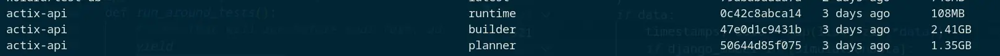
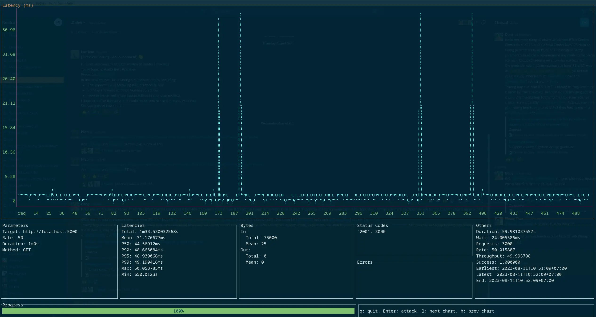
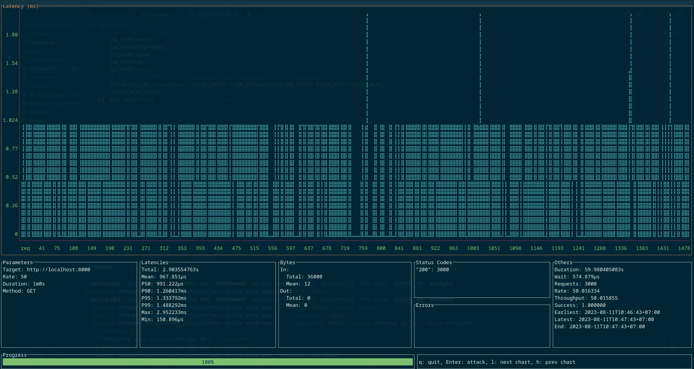

I was learning Rust and thought it would be a fun idea to create a simple CRUD app to test how well Rust app frameworks work in practice. Here is my journey of exploring Rust frameworks to create a proof-of-concept CRUD app.
<!--more-->

## My goal

This project is an experimental CRUD (Create, Read, Update, Delete) API written in Rust. It was created to explore building a simple New-Post CRUD application in Rust, using the popular Actix web framework and Diesel ORM.

> All of the experiment code is available at [my github repo](https://github.com/haicheviet/rust-actix-crud-app)

Some highlighted improvements for this experiment:

* Docker multi-stage build for rust using [cargo-chef](https://github.com/LukeMathWalker/cargo-chef) => The final Docker image only contains the one binary file that is needed to run the application, and it also caches the dependencies. This caching of dependencies helps to speed up the build step significantly.
* Leverage [Diesel migration](https://docs.rs/diesel_migrations/latest/diesel_migrations/macro.embed_migrations.html) to migrate database at compile time => enable ship a single executable file.
* A fun comparison of Python FastAPI and Rust shows that Python struggles to keep up with Rust in terms of performance and reliable.


## Project Scopes

### API Contract

CRUD operations on a sample entity called Post. Each item has an id, title, body and published.

**Create an Item**

```
Endpoint: POST /post
Request Body: JSON object with title, body and optional published fields.
{
    "title": String,
    "body": String,
    "published": Optional[bool] = False,
}
```

**Count all public Post**

```
Endpoint: GET /count-post
```

**Get a post by ID**

```
Endpoint: GET /post/:id
```

**Publish a post**

```
Endpoint: PATCH /post/:id
```

**Delete a post**

```
Endpoint: DELETE /post/:id
```

### Tech stack

- Web framework: [actix-web](https://github.com/actix/actix-web)
- Database: [Postgres-12](https://www.postgresql.org/about/news/postgresql-12-released-1976/)
- Deployment: docker compose

## Cargo chef in docker multi-stage

In general, Docker multi-stage builds are divided into two stages: build and runtime. However, for Rust, this is a bit different. Cargo build can be quite long, and enabling cache for multiple projects (ex: [huggingface-tokenizers](https://github.com/huggingface/tokenizers)) can be difficult. This is because Rust compile cache only works in one workspace, unlike Python, where you can install a single requirements.txt file and share the global dependencies in other folders.

That's why the Cargo chef segment docker multi-stage into three phase:

### 1. Planner

```Dockerfile
FROM chef AS planner
COPY . .
RUN cargo chef prepare --recipe-path recipe.json
```
=> Cargo-chef builds a requirements.txt file from the recipe.json file. This file will contain a list of the dependencies of your project, as well as the compiler flags that you want to use to build them. Thinking it as the requirement file for your Rust project

### 2. Builder

```Dockerfile
FROM chef AS builder 
COPY --from=planner /app/recipe.json recipe.json
# Build dependencies - this is the caching Docker layer!
RUN cargo chef cook --release --recipe-path recipe.json
# Build application
COPY . .
RUN cargo build --release --bin app
```
=> Once you have created the recipe file, you can use the cargo-chef cook command to build the dependencies of your project. This will create a new Docker layer that contains the dependencies. And then we can create a build release or debug based on our need.

### 3. Runtime

```Dockerfile
# We do not need the Rust toolchain to run the binary!
FROM debian:buster-slim AS runtime
WORKDIR /app
RUN apt-get update -y && apt-get install -y libpq-dev # Install postgres client

COPY --from=builder /app/target/release/actix-api /usr/local/bin
CMD  ["/usr/local/bin/actix-api"]
```
=> The last stage is used to copy the compiled application into a minimal image

The final image size of 108 MB is a whopping `2285.03x improvement` over the build stage size of 2.41 GB. This means that the small image will have a significant reduction in download time and storage space.




In addition, the cargo-chef tool can significantly speed up Rust Docker builds. I have seen build times reduced by up to 5x in my own experience. If you are developing a Rust project, I highly recommend using cargo-chef to speed up your Docker builds.

## ORM tools: Diesel
Diesel ORM is a pleasure to use in Rust because it is safe, extensible, documented, and actively maintained. I also find the use of [diesel_migration](https://docs.rs/diesel_migrations/latest/diesel_migrations/) to be pleasant to deploy, as it allows for migrations to be compiled at compile time and shipped as a single binary file.



This is useful if you would like to use Diesel’s migration infrastructure, but want to ship a single executable file (such as for embedded applications). It can also be used to apply migrations to an in memory database (Diesel does this for its own test suite).




```javascript
pub const MIGRATIONS: EmbeddedMigrations = embed_migrations!();

fn run_migration(connection: &mut impl MigrationHarness<diesel::pg::Pg>) {
    match connection.run_pending_migrations(MIGRATIONS) {
        Ok(_) => {
            println!("Migrations successfully completed");
        },
        Err(e) => {
            panic!("error running pending migrations {}", e)
        },
    };
}
#[actix_web::main]
async fn main() -> std::io::Result<()> {
  HttpServer::new(|| {
          let pool = db::get_connection_pool();
          let mut connection = pool.clone().get().unwrap();
          run_migration(&mut connection);
          ...
  }
}
```

With this extension,  I was able to package all of my CRUD apps into a single Docker compose file and run `docker compose up -d` without any hassles.

## Benchmark with python web framework

I think it's no surprise that Rust will run much faster than the Python FastAPI equivalent. However, for the sake of comparing tools, I quickly constructed some benchmarks using [ali framework](https://github.com/nakabonne/ali) just for fun comparation

- Machine: 21E300DYVN ThinkPad E14 Gen 4
- OS: Debian GNU/Linux 12 (bookworm) x86_64
- CPU: 12th Gen Intel i5-1235U (12) @ 4.400GHz 
- GPU: Intel Alder Lake-UP3 GT2 [Iris Xe Graphics] 
- Memory: 16GB
- Web Workers: 4
- Command: `ali --rate=50 --duration=1m $API_ENDPOINT`




Some insight:
- Python's tail latency is more divergent and it struggles to make the p50 closely match the mean.
- Rust outperforms Python in all benchmarks, with a 45x performance improvement.

## Some afterthought

* Rust CRUD apps are somewhat mature and can be a great choice if you want a high-quality product with blazingly fast performance. However, for simple CRUD apps, it may be more effective to use a general-purpose combination like Python and Django.
* I spent a full weekend (around 15 hours) to construct this experiment, even though most of the code was not new and I already had some experience with Rust. In comparison, it only took me 2 hours to polish the Python code.