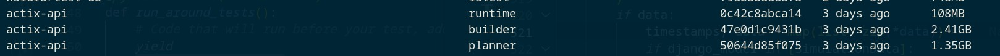
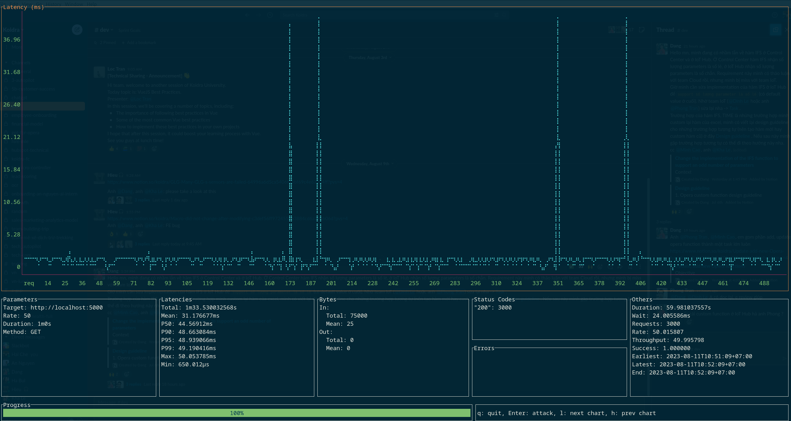
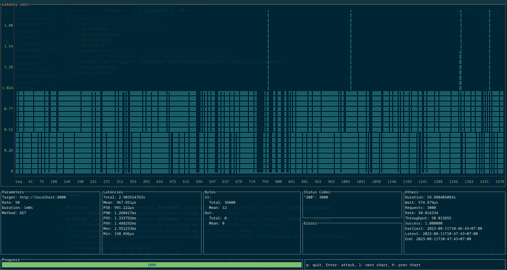

I was learning Rust and thinking should I create a simple CRUD app just to test how well rust app framework in practice.

<!--more-->

## My goal

This project is just an experimental CRUD (Create, Read, Update, Delete) API written in Rust. The purpose of is to explore building a simple New Post CRUD application in Rust, using the popular Actix web framework and Diesel ORM. Mostly for my learning purpose.

> All of the experiment code is available at [my github repo](https://github.com/haicheviet/rust-actix-crud-app)

Some highlighted improvements for this experiment:

* Docker multi-stage build for rust using [cargo-chef](https://github.com/LukeMathWalker/cargo-chef) => enable the last layer to only contain one needed binary file and faster build time.
* Leverage [Diesel migration](https://docs.rs/diesel_migrations/latest/diesel_migrations/macro.embed_migrations.html) to migrate database at compile time => enable ship a single executable file.

* Fun comparison with python fastapi and showing that python struggle to keep up with Rust.

## Cargo chef in docker multi-stage

Firstly, general flow for docker multi-stage is segement into two catergory: Build and Runtime stage. But for rust, the thing here is little bit different, cargo build is quite long and to enable cache for multiple projects binding (ex: [huggingface-tokenizers](https://github.com/huggingface/tokenizers)). It's quite difficult to cache build as rust compile cache only working in one workspace, not like python that you can install one `requirements.txt`` and share global enviroment in other folder.

That's why the cargo chef segment docker multi-stage to three phase:

```Dockerfile
FROM chef AS planner
COPY . .
RUN cargo chef prepare --recipe-path recipe.json
```
=> That build the recipe.json as a requirements.txt file. The recipe file will contain a list of the dependencies of your project, as well as the compiler flags that you want to use to build them.


```Dockerfile
FROM chef AS builder 
COPY --from=planner /app/recipe.json recipe.json
# Build dependencies - this is the caching Docker layer!
RUN cargo chef cook --release --recipe-path recipe.json
# Build application
COPY . .
RUN cargo build --release --bin app
```
=> Once you have created the recipe file, you can use the cargo-chef cook command to build the dependencies of your project. This will create a new Docker layer that contains the dependencies. And then we can create a build release or debug based on our need.


```Dockerfile
# We do not need the Rust toolchain to run the binary!
FROM debian:buster-slim AS runtime
WORKDIR /app
RUN apt-get update -y && apt-get install -y libpq-dev # Install postgres client

COPY --from=builder /app/target/release/actix-api /usr/local/bin
CMD  ["/usr/local/bin/actix-api"]
```
=> The last stage is used to copy the compiled application into a minimal image

Final image size only took 108Mb compare to build stage 2.41Gb => A whooping `2285.03x times` improvement in image size, with small image we can have a significant reduction in download time and storage space.




And even more the cargo-chef tool can significantly speed up Rust Docker builds. In my own experience, I have seen build times reduced by up to 5x. If you are developing a Rust project, I would highly recommend using cargo-chef to speed up your Docker builds.


## ORM tools: Diesel

Diesel ORM is a pleasant to use in Rust because it is safe, extensible, documented, and actively maintained. And I find the use of [diesel_migration](https://docs.rs/diesel_migrations/latest/diesel_migrations/) which is migrate as compile time and enable to ship single binary file  



This is useful if you would like to use Diesel’s migration infrastructure, but want to ship a single executable file (such as for embedded applications). It can also be used to apply migrations to an in memory database (Diesel does this for its own test suite).



```rust
pub const MIGRATIONS: EmbeddedMigrations = embed_migrations!();

fn run_migration(connection: &mut impl MigrationHarness<diesel::pg::Pg>) {
    match connection.run_pending_migrations(MIGRATIONS) {
        Ok(_) => {
            println!("Migrations successfully completed");
        },
        Err(e) => {
            panic!("error running pending migrations {}", e)
        },
    };
}
#[actix_web::main]
async fn main() -> std::io::Result<()> {
  HttpServer::new(|| {
          let pool = db::get_connection_pool();
          let mut connection = pool.clone().get().unwrap();
          run_migration(&mut connection);
          ...
  }
}
```

With this extension, I was able to package all CRUD app into single command `docker compose up -d` without any hassles

## Benchmark with python fastapi for fun

I think we should already expect that rust will run very fast compare to python equaivlant, but for the sake of tool compare. I quickly construct some benchmark using [ali framework](https://github.com/nakabonne/ali) just for fun comparation

- Machine: 21E300DYVN ThinkPad E14 Gen 4
- OS: Debian GNU/Linux 12 (bookworm) x86_64
- CPU: 12th Gen Intel i5-1235U (12) @ 4.400GHz 
- GPU: Intel Alder Lake-UP3 GT2 [Iris Xe Graphics] 
- Memory: 16GB
- Web Workers: 4
- Command: `ali --rate=50 --duration=1m $API_ENDPOINT`




Some insight:
- Python tail latency is more diverge and struggle to make p50 closely with mean.
- Rust kill python perfomance and more stable, 4x performance increase in all benchmark.

## Some afterthought

* Rust web app framework is mature but I find the time to develop is really long and still think you shouldn't use Rust in web app development without specific need.
* It took me a full weekend (~15 hours) to construct this experiement despite most of the code is not new and I already have some experience with rust. Compare to python code that take me only 2 hours to polish.
* Rust crud app is somewhat mature and really worth the efforce if you want a high quality product and blazaingly fast application. But for simple CRUD app, back to general combo python-django is more effective.