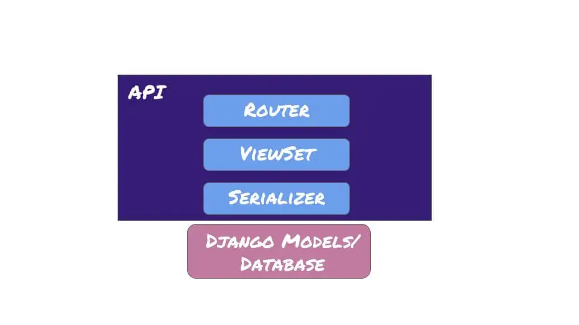
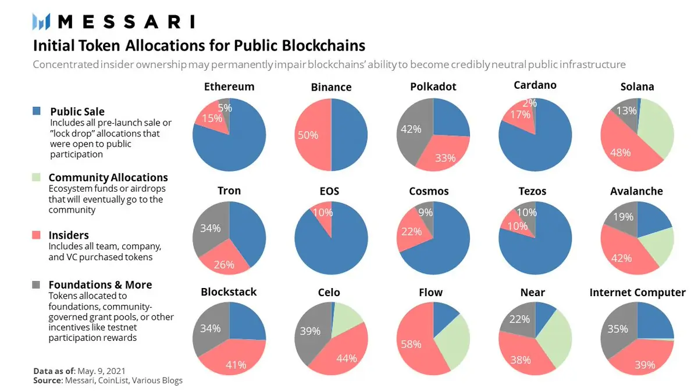
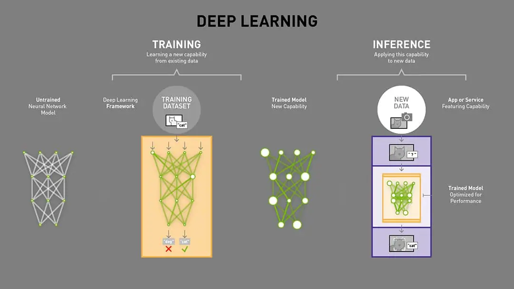
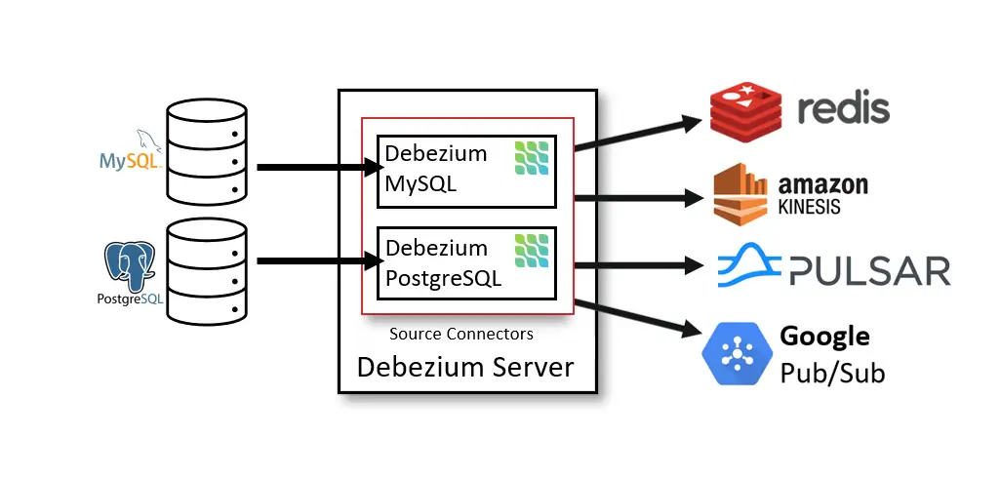
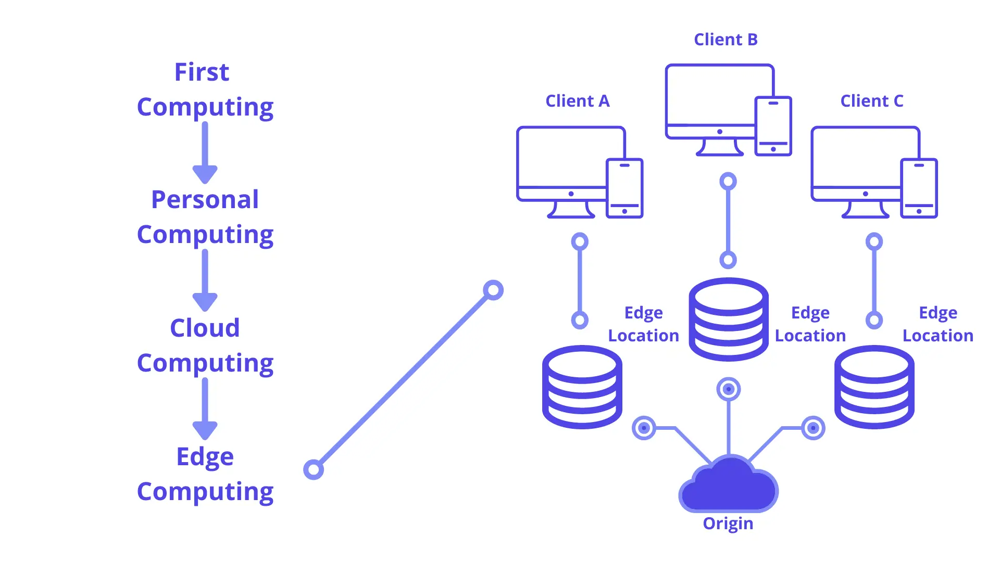
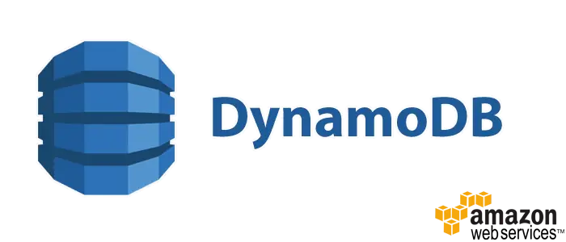
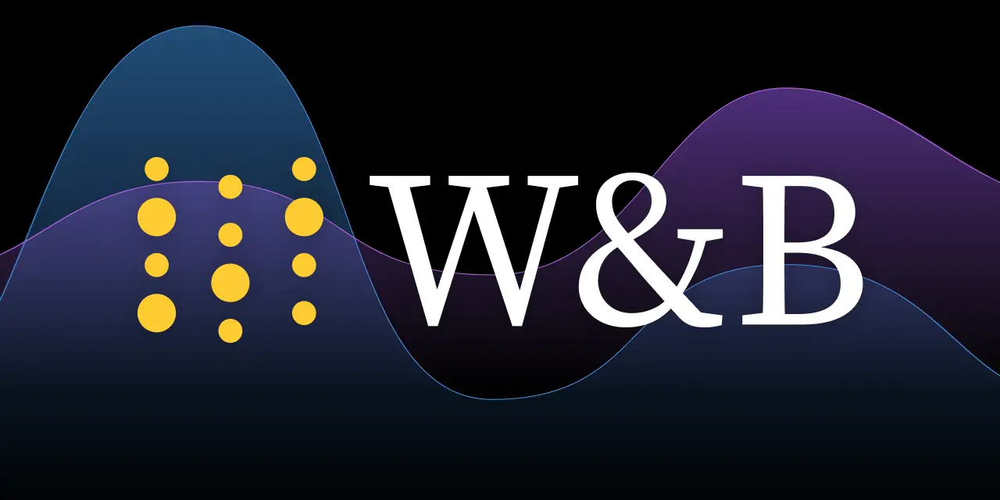

New year new me right, after a year of upheaval, I take some moment to look back the journey of 2022.  This year I want to recap what I learn, and my current thought about it. Furthermore, planning hype tech for next year and we will see if can I learn and try it in 2023. Keeping a journal of what you learn is one of the biggest proofs to compare yourself to who you were last year.
<!--more-->

## Tech I learned in 2022

### Django framework

I just want to look around and experiment Django rest framework in my company codebase. But after playing around and creating some MRs in 2 months, I found the inheritance of serializer and Django model is so easily prone to error and hard to debug. If the application is only CMS or simple CRUD, Django may be the safest choice to launch MVC but the mess inheritance model, and multiple override methods are so frustrating and not healthy in the long run application. A big no from me if I have to pick a framework to start a web app and I still think FastAPI is more suitable and still fast in launch MVC.

### Qdrant database

Vector database is what I struggle with in 2022 and Milvus is not enough for what I needed at that time. I want fast vector search to combine with intensive filtering that our user behavior expects. Thankfully I find Qdrant is perfect for what our team needs the adaptation is very smooth and our team has used it for all the vector database requirements. Additionally, the database tech spark my interest in databases and open source, its project was one of my first big approved MRs for open source.

### Rust language

To contribute and know more about Qdrant database, I have to learn Rust and was fascinated with the strong emphasis on ownership and borrowing. The type checker is so robust that I want to dump all my python projects using Rust. I've adapted some core projects in our company transfer to Rust and was not thankful enough for our members that stick through to learn a new language and align for better correct and efficient code. The performance gain was 4x rather than the old python implement and 50% memory saving in inference. I'm still happy with Rust's implementation and eager to build more projects with rust in 2023.

### Blockchain (Solana chain)

Here we go again :D, the blockchain in begin of 2022 is so hyped that I can not resist learning more about it even though I still think blockchain is not ready for anything serious. As I'm learning rust at that time, I want to find a top chain that was written in Rust and Solana is undoubtedly my first choice. I was fascinated by the smart contract, ledger, ... and the tech is cool and all. But oh boy, like every finance term, the execution of Solana in the real-world is such a scam. The decentralized network is all they brag about but only **5% of the total token is in public sale** and mostly the remaining token is in private equity and founder, what a joke when they said decentralize platform and macro tokenomics.

I still think blockchain have some real use cases that can apply. But the finance world right now is so chaotic and scam that the blockchain tech is still overrated.

### Neovim

The neovim journey is somehow coincidentally, my work laptop got broken and I have to use the old laptop from my partner. The old laptop is ok for everyday task but coding via vscode is so slow and break everytime. I use this opportunity to learn neovim and set some challange for myself. The experience is ok, I learn a lot about neovim config and short cut in vim. Making my hand familar with vim shortcut is somewhat painfull in first 2 weeks, but after sometime that my muscule memory pick up the vim shortcut. But the somewhat controversial faster coding with neovim is still not clear for me and we have to accept that frankly, not many people using vim as their daily coding tool. I can code fast in vim but when guideline teammember, I still use more vscode shortcut and extension. When in senior-lead position, the time took reading code and guidline code was way more than writing code. So I comeback to using vscode with vim extension and that's all, simple is always better.

### Firecrackers and MicroVM

The detail of firecrackers was already descripted in my previous blog, you can check it out [here](https://haicheviet.com/cluster-vm-with-firecracker/). This tech make my life is way more easier when onboarding new member or prototype some new enviroment.

### ML Inference Framework and Trick

I've tried multiple framework deployments such as AWS Sagemaker, Neuron, and Cortex, ... but all these frameworks still missing some points that I need, plus the lock-in tech is too scary to use. Just plain old FastAPI-Pytorch is enough and all the logging, and monitoring should be using another service that was dedicated to it.

Some pruning and quantization method I learned is somewhat useful but just so outdated for the new AI area. The current research on AI is always about iteration, better models were produced every week. By the time I've done optimize some models, these models were already irrelevant and outdated. I think a faster iterate model process (Labeling-Training-Testing) is way more impact than tuning for faster inference time.

### CDC framework (debezium)

CDC framework is ok for my need, the tech is simple to use but the monitoring Kafka service is just a pain in the ass. I was not a Kafka expert and after some rethought about design and people management, I drop the CDC framework and use simple SQS with API signal is more than I need.

### Edge Cloud (Netlify/Vercel)

This year I want to have a personal blog to share more about my journey but I was so cheap that do not want to own a server and if the best, host freely. After some research, I find static content like my blog is serving the best in edge cloud Netlify. The implementation is dead simple and the CDN caching work so well that sometimes I still can not believe I was hosting this performance platform as free. Netlify/Vercel will be my go-to when building FE service or some simple application.

### Dynamodb and Single-table design

The tech stack I'm using is plain simple and effective, but what if I want a serverless system from both application and database. Dynamodb and single-table design approach is my choice for experimenting with this serverless aspect. After reading some resources and testing simple applications, I find out why it's so popular and wants to implement in our company but the 400 KB limit to upload is just big left down for me. I just want all decentralization tables but this limitation is really hard for some big applications and fat content that I was serving. Hopefully will have the chance to work with Dynamondb in 2023.

### MLops tools (Wandb)

Wandb service is just too popular and useful to be ignored in 2022, our team was quickly adapted to the new standard ML flows and still planning to use it in 2023. Solid A-tier service from me.

## Tech I planning to learn in 2023

### OpenAI LLM (ChatGPT), Whisper AI and voice assistant

ChatGPT is one of the big leaps for the AI industry that I can ignore. Will try to make a personal assistant from openAI and can not wait to implement it in the near future.

### Kubernetes

Nah still a big letdown for me, the complexity and the need for a platform engineer are not what I want to use for a start-up or small team. But I still want to be openminded and hope will have a chance to use it in 2023.

### HPC cluster admintration and parallel training

I have not had to use a big HPC GPU cluster. Hopeful will have the chance to use and experience it in 2023.

### Database consensus cluster

Still have not had a chance to use multiple leader database clusters in 2022, plan to learn, scale, and have a chance to use it in near future.

### Nodejs and Animation

I just saw some really beautiful blogs and want to implement mine, need to start learning Nodejs and animation to make AI more friendly I guess.

### Timeserise Database (Influx db)

Planning to build a trading platform and Influx DB is my choice for the database. Happy with it so far at beginning of 2023 and want to dive deeper into the database.

### Planetscale database

I want to experiment with serverless tech and thinking to replace traditional SQL with Plannetscale for my side project. Will update the journey in the near short term.

### GPU serverless (Modal cloud)

Serverless all the way, will test some GPU vendor serverless and see how it goes in 2023. The [modal](https://modal.com/) looks promising and curious about how scalable it is in real-world usage.

### Vectorized Query Execution and SIMD programming

More than a coding challenge rather than tech here, I've known this low-level coding for a while from the OLAP database but want to implement it from scratch to have a better understanding.

## Tech I still using from my very first year

Boring is what I need to make money though, here is the list tech that I'm using and planning to still use in 2023:

- FastAPI framework
- Mysql/Postgresql
- VScode
- AWS (ECS-SQS-Lambda)
- Cloudformation/Terraform/Ansible
