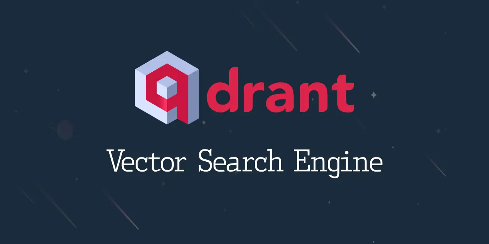
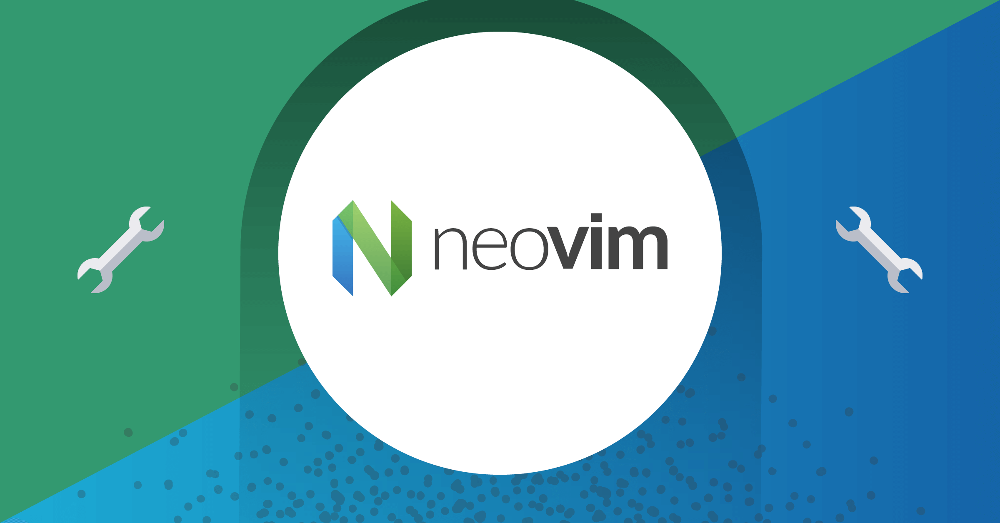

New year new me right, here is a section I want to do every year to recap what I learn, my current thought about it. Furthermore, planning hype tech for next year and we will see can I learn and try it in 2023.
<!--more-->

## Tech I learned in 2022

### Django framework

I just want to look around and experiement some django rest framework in my company team. But after playing around and create some MRs in 2 months, I found the inheritance of serializer and django model is so easy prone to error and hard to debug. If the application is only CMS or simple CRUD, django may be the fastest to launch MVC but the mess inhereintance model overlap each other is so frustrated and not healthy in long run application. Big no from me if I have to pick framework to start web-app and I still think Fastapi is more suitable and still fast in launch MVC.

### Qdrant database

Vector database is what I struggle in 2021 and Milvus is not enough for what I needed in that time. I want fast vector search combine with intenstive filtering that our user behavior expect. Thankfully I find Qdrant is perfect for what our team need and the adaptation is very smooth and our team have used it for all the vector database require. Additionaly, the database tech spark my interest in database and opensource, its project was one of mine big approved MRs for opensource.  

### Rust language

To contribute and know more about qdrant database, I have to learn Rust and fascinated with the strong emphasis on ownership and borrowing. The type checker is so robust that I want to dump all my python project to using Rust. I've adapt some core project in our company tranfer to Rust and was not thankfull enough for our members that stick through to learn new language and allign for better correct and efficient code. The performance gain was 4x rather then old python implement and 50% memory saving in inference. I'm still happy with rust language and eager to build more project with rust in 2023

### Blockchain (Solana chain)

Here we go again :D, the blockchain in begin of 2021 is so hype that I can not resist to learn more about it despite the fact that I still think blockchain is not ready for anything serious. As I'm learning rust at that time, I want to find a top chain that was written in Rust and Solana is undoutly my first choice. I really was facinated about the smart-contract, ledging, ... and the tech is really cool and all. But oh boy, like every finance term, the execution of Solana in real world is such a scam. The decentralize network is all they brag about but only **5% of total token is in public sale** and mostly the remain token is in private equity and founder, what a joke when they said decentralize platform and macro tokenomics.

I still think blockchain have some real use cases that can apply. But the finance world right now is so chaotic and scam that the blockchain tech is still overrated.

### Neovim

The neovim journey is somehow coincidentally, my work laptop got broken and I have to use the old laptop from my partner. The old laptop is ok for everyday task but coding via vscode is so slow and break everytime. I use this opportunity to learn neovim and set some challange for myself. The experience is ok, I learn a lot about neovim config and short cut in vim. Making my hand familar with vim shortcut is somewhat painfull in first 2 weeks, but after sometime that my muscule memory pick up the vim shortcut. But the somewhat controversial faster coding with neovim is still not clear for me and we have to accept that frankly, not many people using vim as their daily coding tool. I can code fast in vim but when guideline teammember, I still use more vscode shortcut and extension. When in senior-lead position, the time took reading code and guidline code was way more than writing code. So I comeback to using vscode with vim extension and that's all, simple is always better.

### Firecrackers and MicroVM

The detail of firecrackers was already descripted in my previous blog, you can check it out [here](https://haicheviet.com/cluster-vm-with-firecracker/). This tech make my life is way more easier when onboarding new member or prototype some new enviroment.

### ML Inference Framework and Trick

I've tried multiple framework deployment such as: AWS Sagemaker, Neuron, Cortex, ... but all these framework still missing some point that I need and plus the lock-in tech is too scary to use. Just plain old fastapi-pytorch is enough and all the logging, monitor should be using other service that was dedicated for it.

Some pruning and quantization method I learned is somewhat usefull but just so outdated for the new AI area. The current research AI is always about speed, better model was produce every week. By the time I've done optime some models, these models were already unrelevant and poor accuracy. I think faster iterate model process (Labeling-Training-Testing) is way more impact than tuning for faster inference time.

### CDC framework (debezium)

CDC framework is ok for my need, the tech is simple to use but the monitoring kafka service is just pain in the ass. I was not some kafka expert and after some rethought about design and people managment, I drop the CDC framework and use simple SQS with API signal trigger update is still enough for my need.

### Edge Cloud (Netlify/Vercel)

This year I want to have a personal blog to share more about my journey but I was so cheap that do not want to own a server and if the best, hosting freely. After some research, I find static content like my blog is serving the best in edge cloud netlify. The implementation is dead simple and the CDN caching work so well that sometime I still can not believe I was hosting this performance platform is free. Netlify/Vercel will be my goto when building FE service or some simple application.

### Dynamodb and Single-table design

The techstack I'm using is plain simple and effective, but what if I want totally serverless system from both application and database. Dynamodb and single-table design approach is my choice for experiementing in this serverless aspect. After reading some resource and testing simple application, I find why it's so popular and really want to implement in our company but the 400 KB limit to upload is just big left down from me. I just want all decentralization table but only can upload 400kb per row is really limit some big application and fat content that I was serving. Hopefully will have the chance to work with Dynamondb in 2023

### MLops tools (Wandb)

Wandb service is just too popular and usefull to be ignore in 2022, our team was quickly adatp this service and still planning to use in 2023. Solid A tier service from me.

## Tech I planning to learn in 2023

### OpenAI LLM (ChatGPT), Whisper AI and voice assistant

ChatGPT is one of a big leap for AI industry that I can ignore. Will try to make a personal assistant from openAI and can not wait to implement it in near future

### Kubernetes

Nah still big let down from me, the complexity and the need for platform engineer is still not what I want to implement. But I still want to openminded and hope will have a chance to implement it in 2023.

### HPC cluster admintration and parallel training

I have not had a ocacsion to use big HPC gpu cluster. Will definitly find the chance to use and experience it in 2023

### Database consensus cluster

Still have not a chance to use multiple leader database cluster in 2022, plan to learn, scale and have a chance to use it in near future

### Nodejs and Animation

I just saw some really beautifull blog and want to implement to mine, need to learn nodejs and animation to make AI more friendly i guess.

### Timeserise Database (Influx db)

Planning to build some trading platform and influx db is my choice for database. Happy with it so far in beginning of 2023 and want to dive deeper in the database.

### Planetscale database

I want to experiencement serverless tech and thinking to replace postgresql to plannetscale for my side project. Will update the experience in near short term.

### GPU serverless (Modal cloud)

Serverless all the go, will test some GPU vendor serverless and see how it go in 2023. Will tested [modal](https://modal.com/) how scalable it is in real world usage.

### Vectorized Query Execution and SIMD programming

More than coding challange rather than tech here, I've known this low-level coding this for a while from OLAP database but want to implement it from scratch to have better understanding it.

## Tech I still using from my very first year

Boring is what I need to make money though, here is the list tech that I'm using and planning to still use in 2023:

- Fastapi framework
- Mysql/Postgresql
- VScode
- AWS
- Cloudformation
